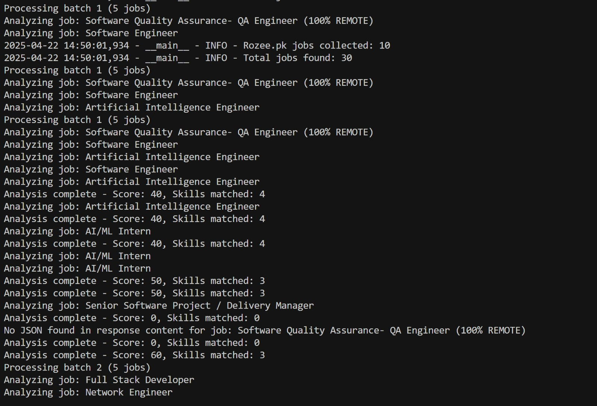
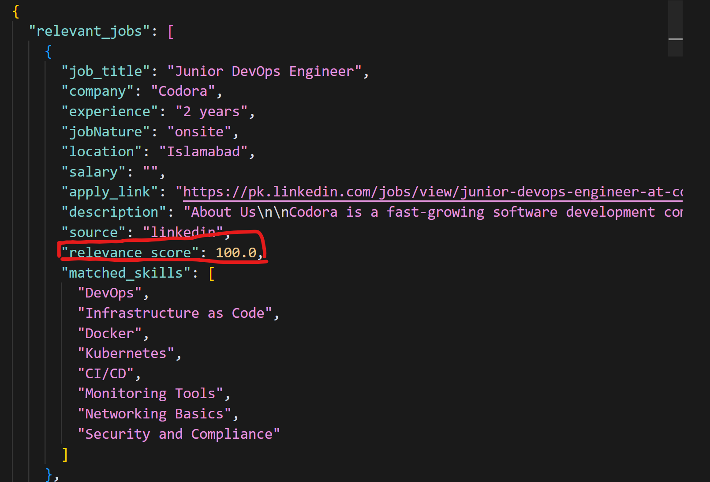
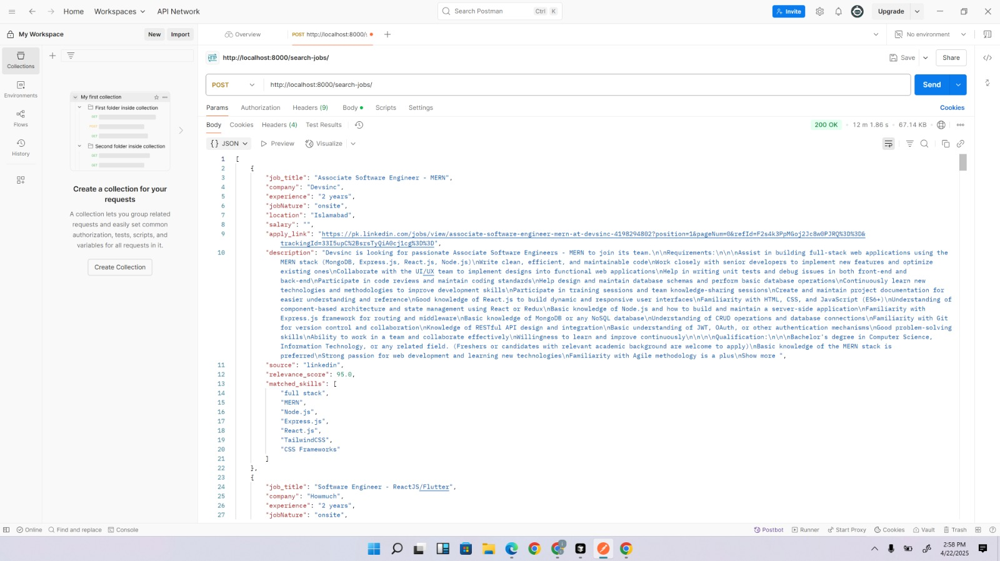

# Job Finder API

A FastAPI-based job search API that aggregates and analyzes job listings from multiple sources using LLM-based relevance matching.

## Features

- 🔍 Search jobs from multiple sources (LinkedIn, Indeed, Rozee.pk)
- 🤖 LLM-powered job relevance analysis using Ollama R1deepsake model
- 📊 Structured JSON response format
- ⚡ Fast and efficient job matching
- 🔒 Secure API endpoints
- 🔄 Asynchronous job processing
- 📝 Comprehensive logging and error handling

## Technical Implementation

### Job Scraping Process
- Each source (LinkedIn, Indeed, Rozee.pk) is scraped independently
- Latest 10 jobs are fetched from each source (can be adjusted in max_jobs)
- Selenium with undetected-chromedriver for Indeed scraping
- LinkedIn-jobs-scraper package library for LinkedIn scraping
- BeautifulSoup for Rozee.pk scraping
- Rate limiting and anti-detection measures implemented
- Comprehensive error handling and logging

### Logic Overview For LinkedIn Job Scrapper
By using scrape_linkedin_sync()

####  Experience Mapping:

- If experience contains "2" or "two" → filters for Associate roles.
- If experience contains "5" or "five" → filters for Mid-Senior roles.
- Defaults to Entry Level if no match is found.

#### LinkedIn Filters:

- Filters results by Relevance and Time Posted.
- Includes only Full-Time job postings.
- Combines multiple experience levels as fallback (e.g., Entry + Associate).

#### Job Cap:

- Processes only the first 10 jobs (adjustable via max_jobs parameter).

#### Rate Limiting:

- Adds a 5-second delay after each job to avoid detection or blocking by LinkedIn.

### LOgic Overview for Indeed Job Scraper 
- BeautifulSoup is utilized for parsing HTML as well as scraping job details.

#### 1. Building Search URLs 🔗
- From job role and location we construct a search query🏙️.
- we manage the pagination by modifying the start parameter in the URL.

#### 2. Page Scraping Loop 🔁
- Iterates between search result pages (3 pages at most) 📄📄📄. For each page, the scraper waits for the page to load completely by using (await asyncio.sleep(5)) to prevent bot detection and ensure accurate scraping ⏱️🤖.

#### 3. Job Information Extraction 🧠
For every job card:

- Parses Title, Company, Location, and Salary with flexible selectors 💼🏢📍💰 using flexible CSS selector.
- Derives and applies link to obtain full job descriptions 🔍. It is done by navigating to the job's specific link. It uses BeautifulSoup to parse the HTML and locate the description 
- Utilizes regex to extract keywords related to experience ✨
- Constructs and adds structured job data to the results list 🧱📊

#### 4. Job Details Retrieval 🔎
- Opens every job link in new tabs 🗂️
- Extracts full job description and metadata like posting date and company header info 📝📅
- Handles missing fields and errors safely.

#### CAPTCHA is bypass by using anti-bot mechanisms which is undetected-chromedriver which modif the chrome browser in such a that is does not raise flags with CAPTCHA systems by mimics human-like interaction with the website.
#### nodriver is also used which manage headless browsing more efficiently by further reducing the chances of detection. Below are the pictures which show the captcha bypassing.


The below screenshot show the indeed scrapper is working.


### Logic Overview for Rozee pk
- 🕵️‍♂️ Uses Selenium with `undetected-chromedriver` to scrape jobs from Rozee.pk.  
- 🔍 Accepts job title and city code to build the search URL.  
- 📋 Extracts job title, company, location, experience, salary, and job link.  
- 🛡️ Avoids duplicate jobs using a unique identifier check.  
- 📄 Fetches detailed job descriptions and metadata from each listing.  
- 💾 Stores results in a list and supports export to JSON or CSV.


### LLM Analysis Process
- Uses local Ollama R1deepsake model for job analysis
- Asynchronous processing of job descriptions




- Relevance scoring based on:
  - Position match
  - Experience requirements
  - Location compatibility
  - Skills matching
  - Job nature (onsite/remote/hybrid)
- Generates matched skills list
- Provides relevance score (0-100)




### Data Processing
- Jobs are collected asynchronously from all sources
- Data is normalized into a consistent format
- Results are cached to improve performance
- Export options: JSON and CSV formats
- Comprehensive logging of the entire process

## API Endpoints

### 1. Search Jobs
```
POST /search-jobs/
```

**Request Body:**
```json
{
    "position": "Full Stack Engineer",
    "experience": "2 years",
    "salary": "70,000 PKR to 120,000 PKR",
    "jobNature": "onsite",
    "location": "Peshawar, Pakistan",
    "skills": "full stack, MERN, Node.js, Express.js, React.js, Next.js, Firebase, TailwindCSS, CSS Frameworks, Tokens handling",
    "sources": ["indeed", "linkedin", "rozee"]
}
```

**Response:**
```json
{
    "relevant_jobs": [
        {
            "job_title": "Full Stack Engineer",
            "company": "XYZ Pvt Ltd",
            "experience": "2+ years",
            "jobNature": "onsite",
            "location": "Islamabad, Pakistan",
            "salary": "100,000 PKR",
            "apply_link": "https://linkedin.com/job123",
            "description": "Job description here...",
            "source": "linkedin",
            "relevance_score": 0.85,
            "matched_skills": ["Node.js", "React.js", "Express.js"]
        }
    ]
}
```


### 2. Test Ollama Connection
```
GET /test-ollama/
```

Tests the connection to the Ollama LLM service.

## Job Matching Process

1. **Job Collection:**
   - The API collects latest 10 jobs from each specified source
   - Each source is scraped asynchronously
   - Rate limiting implemented to avoid detection
   - Comprehensive error handling for each source

2. **LLM Analysis:**
   - Job descriptions are analyzed using Ollama R1deepsake model
   - Asynchronous processing of all jobs
   - The LLM compares job requirements with user criteria
   - Generates relevance scores (0-1) and matched skills
   - Analysis includes position, experience, location, and skills matching

3. **Response Generation:**
   - Jobs are sorted by relevance score
   - Structured response includes all relevant job details
   - Results are saved to JSON and CSV files
   - Comprehensive logging of the entire process

## API Testing

### 1. Search Jobs
```bash
curl -X POST "http://localhost:8000/search-jobs/" \
-H "Content-Type: application/json" \
-d '{
  "position": "Software Engineer",
  "experience": "2 years",
  "salary": "70,000 PKR to 120,000 PKR",
  "jobNature": "onsite",
  "location": "Islamabad",
  "skills": "full stack, MERN, Node.js, Express.js, React.js, Next.js, Firebase, TailwindCSS, CSS Frameworks, Tokens handling",
  "sources": ["indeed", "linkedin", "rozee"]
}'
```

### 2. Test Ollama Connection
```bash
curl -X GET "http://localhost:8000/test-ollama/"
```

### Example Response
```json
{
    "status": 200,
    "response": {
        "test": true
    }
}
```

## Setup

1. Clone the repository
2. Install dependencies:
   ```bash
   pip install -r requirements.txt
   ```
3. Set up environment variables:
   ```
   OLLAMA_API=http://{your_local_api}:11434
   ```
4. Run the API:
   ```bash
   python main.py
   ```

## Requirements

- Python 3.10+
- FastAPI
- BeautifulSoup4
- httpx
- python-dotenv
- selenium
- undetected-chromedriver
- linkedin-jobs-scraper
- Ollama (for LLM processing)

## Notes

- The API requires Ollama to be running locally for job analysis
- Web scraping may be subject to rate limits from job platforms
- Results are cached to improve performance for repeated searches
- Comprehensive logging helps in debugging and monitoring
- Rate limiting implemented to avoid detection and blocking
- Error handling implemented for all major components
- Asynchronous processing for better performance

